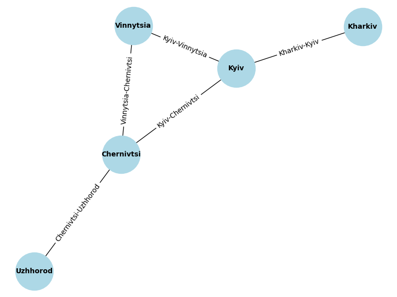
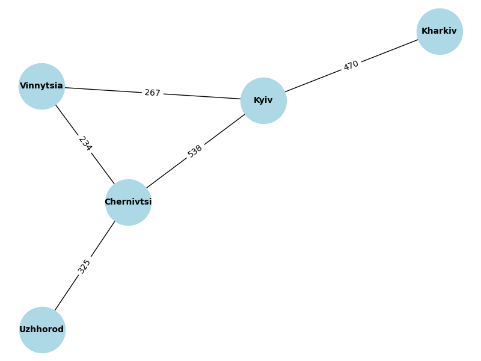

## Завдання 1

- Створіть граф за допомогою бібліотеки `networkX` для моделювання певної реальної мережі (наприклад, транспортної мережі міста, соціальної мережі, інтернет-топології).
- Візуалізуйте створений граф, проведіть аналіз основних характеристик (наприклад, кількість вершин та ребер, ступінь вершин).

## Завдання 2

- Напишіть програму, яка використовує алгоритми `DFS` і `BFS` для знаходження шляхів у графі, який було розроблено у першому завданні.
- Далі порівняйте результати виконання обох алгоритмів для цього графа, висвітлить різницю в отриманих шляхах. Поясніть, чому шляхи для алгоритмів саме такі.

## Завдання 3

## Реалізуйте `алгоритм Дейкстри` для знаходження найкоротшого шляху в розробленому графі: додайте у граф ваги до ребер та знайдіть найкоротший шлях між всіма вершинами графа.

## Завдання 1



```python
Кількість вершин: 5
Кількість ребер: 5
Ступінь кожної вершини:
Kharkiv: 1
Kyiv: 3
Vinnytsia: 2
Chernivtsi: 3
Uzhhorod: 1
```

## Опис результатів до завдання 2

Для графа, який ми розглядаємо (міста Харків, Київ, Вінниця, Чернівці та Ужгород), результати обох алгоритмів для пошуку шляху між Харковом і Ужгородом виглядають однаково:

```python
Шлях з Kharkiv до Uzhhorod за допомогою DFS: ['Kharkiv', 'Kyiv', 'Chernivtsi', 'Uzhhorod']
Шлях з Kharkiv до Uzhhorod за допомогою BFS: ['Kharkiv', 'Kyiv', 'Chernivtsi', 'Uzhhorod']
```

**Чому результати однакові?**

**1. Алгоритм DFS (глибина):**

- DFS працює так, що йде по шляху глибше, поки не досягне кінцевої вершини (Ужгород у нашому випадку), а вже потім перевіряє інші варіанти.
- Починаючи з Харкова, DFS йде через Київ, оскільки це перший доступний сусід. Далі обирає Чернівці, а після цього йде до Ужгорода.
- Оскільки немає відгалужень, які DFS міг би досліджувати перед тим, як досягти Ужгорода, шлях виглядає прямолінійним: Харків → Київ → Чернівці → Ужгород.

**2. Алгоритм BFS (ширина):**
- BFS досліджує граф пошарово, тобто спочатку перевіряє всі можливі вершини на одному рівні перед тим, як переходити на наступний.
- BFS починає з Харкова і перевіряє його сусідів. Єдиний сусід Харкова — це Київ. Далі BFS перевіряє всіх сусідів Києва, серед яких є Чернівці та Вінниця.
- Оскільки Чернівці ближче до Ужгорода, BFS обирає шлях через Чернівці і, нарешті, йде до Ужгорода. Таким чином, результат той самий: Харків → Київ → Чернівці → Ужгород.

**Чому шляхи однакові?**

- **Граф простий та незбалансований:** У нашому графі є лише кілька ребер, і між Харковом та Ужгородом не так багато можливих шляхів. Обидва алгоритми мають обмежену кількість варіантів, тому вибір обмежений.
- **Найкоротший шлях:** Незалежно від алгоритму, і DFS, і BFS знаходять один і той самий шлях, оскільки це фактично найкоротший шлях у плані кількості вершин між Харковом та Ужгородом.

**Різниця між алгоритмами в загальному випадку:**

- **DFS** (пошук у глибину) часто знаходить довший шлях, оскільки досліджує глибину графа, перш ніж повернутися назад для перевірки інших варіантів. Він може знайти перший можливий шлях, який не завжди буде оптимальним (найкоротшим).
- **BFS** (пошук у ширину) завжди знаходить найкоротший шлях за кількістю ребер, оскільки досліджує всі можливі варіанти на одному рівні перш ніж переходити на наступний.

**Висновок:**
У випадку нашого простого графа результат однаковий, оскільки немає багатьох альтернативних шляхів між містами, і найкоротший шлях за кількістю вершин однаковий для обох алгоритмів. У більш складних графах, особливо з великою кількістю відгалужень, DFS і BFS могли б давати різні результати, і BFS зазвичай гарантує найкоротший шлях.

## Завдання 3



```python
Найкоротші шляхи від Kharkiv:
до Kharkiv: шлях ['Kharkiv'], довжина 0 км
до Kyiv: шлях ['Kharkiv', 'Kyiv'], довжина 470 км
до Vinnytsia: шлях ['Kharkiv', 'Kyiv', 'Vinnytsia'], довжина 737 км
до Chernivtsi: шлях ['Kharkiv', 'Kyiv', 'Vinnytsia', 'Chernivtsi'], довжина 971 км
до Uzhhorod: шлях ['Kharkiv', 'Kyiv', 'Vinnytsia', 'Chernivtsi', 'Uzhhorod'], довжина 1296 км
Найкоротші шляхи від Kyiv:
до Kyiv: шлях ['Kyiv'], довжина 0 км
до Kharkiv: шлях ['Kyiv', 'Kharkiv'], довжина 470 км
до Vinnytsia: шлях ['Kyiv', 'Vinnytsia'], довжина 267 км
до Chernivtsi: шлях ['Kyiv', 'Vinnytsia', 'Chernivtsi'], довжина 501 км
до Uzhhorod: шлях ['Kyiv', 'Vinnytsia', 'Chernivtsi', 'Uzhhorod'], довжина 826 км
Найкоротші шляхи від Vinnytsia:
до Vinnytsia: шлях ['Vinnytsia'], довжина 0 км
до Kyiv: шлях ['Vinnytsia', 'Kyiv'], довжина 267 км
до Chernivtsi: шлях ['Vinnytsia', 'Chernivtsi'], довжина 234 км
до Uzhhorod: шлях ['Vinnytsia', 'Chernivtsi', 'Uzhhorod'], довжина 559 км
до Kharkiv: шлях ['Vinnytsia', 'Kyiv', 'Kharkiv'], довжина 737 км
Найкоротші шляхи від Chernivtsi:
до Chernivtsi: шлях ['Chernivtsi'], довжина 0 км
до Vinnytsia: шлях ['Chernivtsi', 'Vinnytsia'], довжина 234 км
до Uzhhorod: шлях ['Chernivtsi', 'Uzhhorod'], довжина 325 км
до Kyiv: шлях ['Chernivtsi', 'Vinnytsia', 'Kyiv'], довжина 501 км
до Kharkiv: шлях ['Chernivtsi', 'Vinnytsia', 'Kyiv', 'Kharkiv'], довжина 971 км
Найкоротші шляхи від Uzhhorod:
до Uzhhorod: шлях ['Uzhhorod'], довжина 0 км
до Chernivtsi: шлях ['Uzhhorod', 'Chernivtsi'], довжина 325 км
до Vinnytsia: шлях ['Uzhhorod', 'Chernivtsi', 'Vinnytsia'], довжина 559 км
до Kyiv: шлях ['Uzhhorod', 'Chernivtsi', 'Vinnytsia', 'Kyiv'], довжина 826 км
до Kharkiv: шлях ['Uzhhorod', 'Chernivtsi', 'Vinnytsia', 'Kyiv', 'Kharkiv'], довжина 1296 км
```
